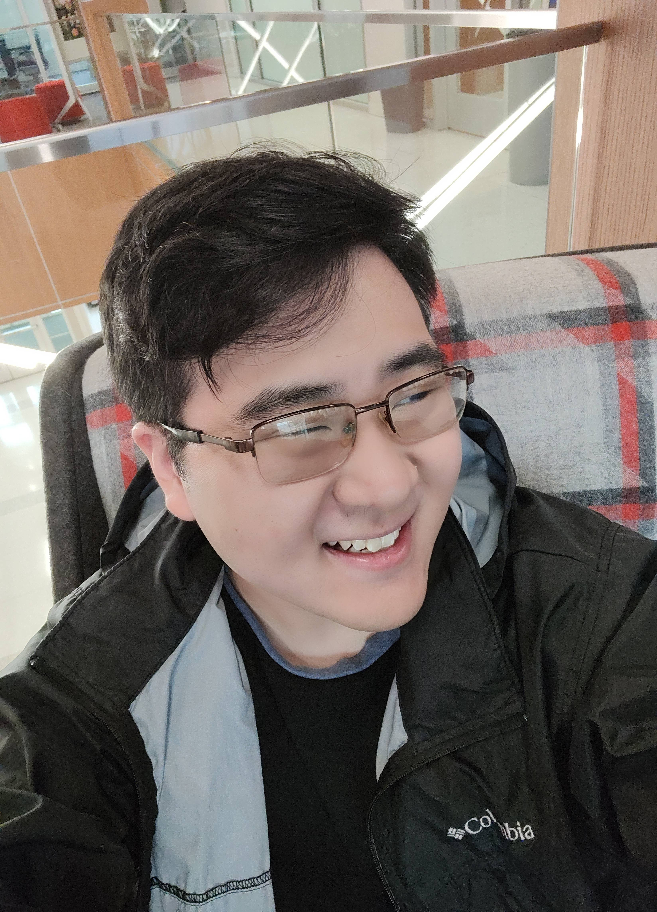

## Welcome!

My name is Caleb Won and I'm a games programmer who is particularly interested in physics, system design, and animations! For some quick introductions here are some facts about me (as of 7/3/2025):

<table border="0" cellspacing="0" cellpadding="0">
<tr>
<td></td>
<td>

  - My favorite game currently is NieR Replicant.
  - My favorite game genres are: RPGs, Fighting Games, and First Person Shooters.
  - My favorite foods are tied between Mexican and Korean food (big spice lover).
  - Hobbies outside of games include cooking, drawing, and model kit building. In particular Gundam models!
  - I am a dog person.
  - My go to music genres are RnB, funk, and J-pop.
  - I'm 100% Korean, but was completely born and raised in Texas (yeehaw).

</td>
</tr>
</table>

<!--
**Wonton230/Wonton230** is a ✨ _special_ ✨ repository because its `README.md` (this file) appears on your GitHub profile.

Here are some ideas to get you started:

- 🔭 I’m currently working on ...
- 🌱 I’m currently learning ...
- 👯 I’m looking to collaborate on ...
- 🤔 I’m looking for help with ...
- 💬 Ask me about ...
- 📫 How to reach me: ...
- 😄 Pronouns: ...
- ⚡ Fun fact: ...
-->
