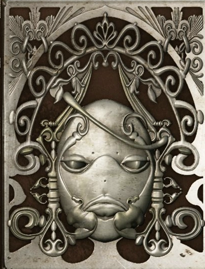
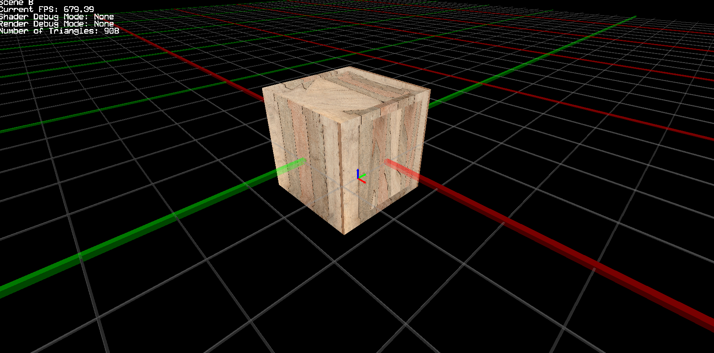
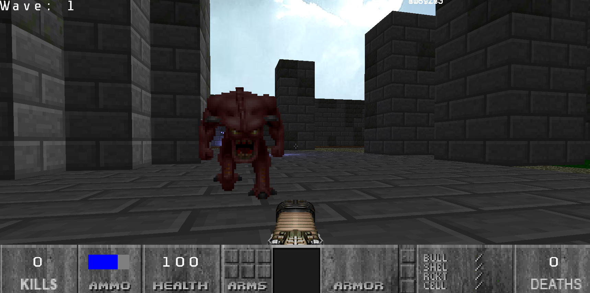

## Welcome!

My name is Caleb Won and I'm a games programmer who is particularly interested in physics, system design, and animations! I currently live in the U.S. and am pursuing a Master's in Interactive Technology from Southern Methodist University in Texas. 

Here are some facts about me (as of 7/3/2025):

<table border="0" cellspacing="0" cellpadding="0">
<tr>
<td></td>
<td>

  - I am a big fan of series like NieR, Halo, Fire Emblem, Street Fighter, and frankly too many others to name.
  - My favorite game genres are: RPGs, Fighting Games, and First Person Shooters.
  - My favorite foods are tied between Mexican and Korean food (big spice lover).
  - Hobbies outside of games include cooking, drawing, and model kit building. In particular Gundam models!
  - I am a dog person.
  - My go to music genres are RnB, funk, and J-pop.
  - I'm 100% Korean, but was completely born and raised in Texas (yeehaw).

</td>
</tr>
</table>

## Some Projects on Here...
# The Engine
This is the game engine that powers many of the other projects on this page including Doomenstein. It supports the basic needs of 2D and 3D games with some nice features like a Dev Console, DX11 rendering, 3D audio using FMOD, and lots of basic math utilities that make games work in both 2D and 3D space.

# Doomenstein
Doomenstein is a First-Person shooter built in my personal engine. It is a 2.5D game taking queues from its namesake series, DOOM and Wolfenstein. It implements basic gunplay mechanics to fight off demons and even includes a 2 player versus mode using the keyboard/mouse and an Xbox controller.

<!--
**Wonton230/Wonton230** is a ✨ _special_ ✨ repository because its `README.md` (this file) appears on your GitHub profile.

Here are some ideas to get you started:

- 🔭 I’m currently working on ...
- 🌱 I’m currently learning ...
- 👯 I’m looking to collaborate on ...
- 🤔 I’m looking for help with ...
- 💬 Ask me about ...
- 📫 How to reach me: ...
- 😄 Pronouns: ...
- ⚡ Fun fact: ...
-->
