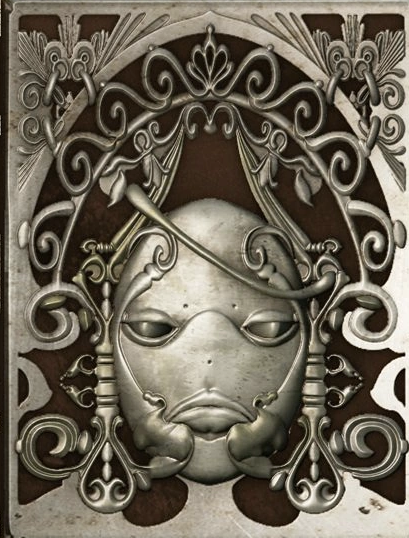
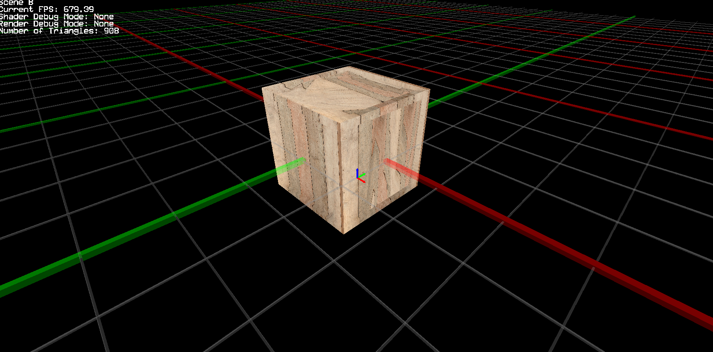
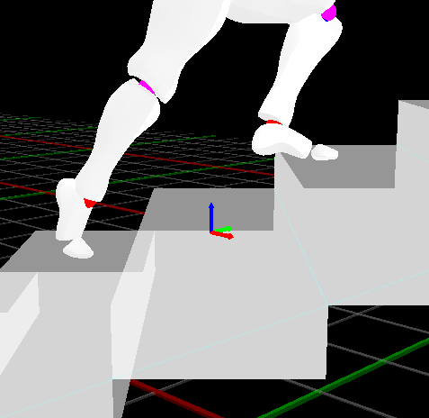
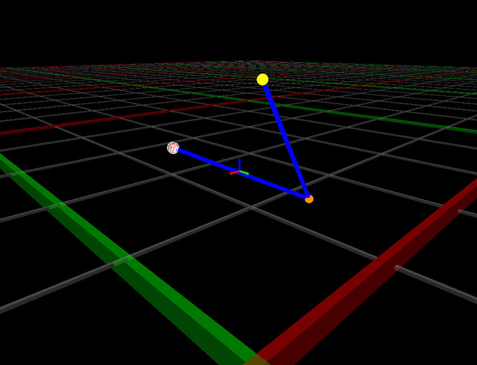

# Welcome!

My name is Caleb Won and I'm a games programmer who is particularly interested in physics, user interface design, AI, and animations! I currently live in the U.S. and am pursuing a Master's in Interactive Technology from Southern Methodist University in Texas. 

Here are some facts about me (as of 11/26/2025):

<table border="0" cellspacing="0" cellpadding="0">
<tr>
<td></td>
<td>

  - I am a big fan of series like NieR, Halo, Fire Emblem, Street Fighter, and frankly too many others to name.
  - My favorite game genres are: RPGs, Fighting Games, and First Person Shooters.
  - My favorite foods are tied between Mexican and Korean food (big spice lover).
  - Hobbies outside of games include cooking, drawing, and model kit building. In particular Gundam models!
  - I am a dog person.
  - My go to music genres are RnB, funk, and J-pop.
  - I'm 100% Korean, but was completely born and raised in Texas (yeehaw).

</td>
</tr>
</table>

# Some Projects on Here...
## [Forseti Engine](https://github.com/Wonton230/Engine)
This is the game engine that powers other games and demos on this page. It supports the basic needs of 2D and 3D games with some nice features like a Dev Console, DX11 rendering, 3D audio using FMOD, and lots of basic math utilities that make games work in both 2D and 3D space.

## [Skeletal Animation System](https://github.com/Wonton230/Skeletal-Animation-Demo)
This is a basic skeletal animation system created in Forseti Engine which uses FBX files as input. It supports basic features like animation blending with layers, local space pose construction, skinned mesh rendering, and animation state definitions and transitions. In addition, the system also provides foot and arm IK solver classes which allow the entire animated character to react physically to its environments in real time.
<table border="0" cellspacing="0" cellpadding="0">
<tr>
<td></td>
<td></td>
</tr>
</table>

<!--
**Wonton230/Wonton230** is a ✨ _special_ ✨ repository because its `README.md` (this file) appears on your GitHub profile.

Here are some ideas to get you started:

- 🔭 I’m currently working on ...
- 🌱 I’m currently learning ...
- 👯 I’m looking to collaborate on ...
- 🤔 I’m looking for help with ...
- 💬 Ask me about ...
- 📫 How to reach me: ...
- 😄 Pronouns: ...
- ⚡ Fun fact: ...
-->
